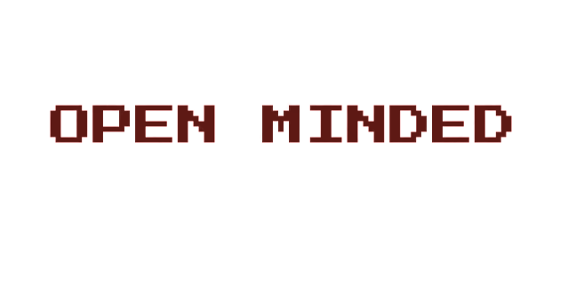

  
  <h1>📄 Description </h1>
  Open minded is a team made up of 4 members. We are tasked to create a c++ game about bitwise operations
  <h1>🧑‍🤝‍🧑 Our Team </h1>
  

  
1. **Ivo Badalov** - **Scrum trainer**	
   > ***GitHub profile***: [***IVBadalov21***](https://github.com/IVBadalov21)	

2. **Georgi ivanov** - **Backend Developer** 
   > ***GitHub profile***: [***GNIvanov21***](https://github.com/GNIvanov21)	

3. **Teodor Tanev** - **Frontend Developer** 
   > ***GitHub profile***: [***TDTanev21***](https://github.com/TDTanev21)	

4. **Simeon Syarov** - **QA engineer** 
   > ***GitHub profile***: [***SMSyarov21***](https://github.com/SMSyarov21)
  

  
  <h1>👨‍💻 Used technologies</h1>
  
 
	 
	<a> <https://upload.wikimedia.org/wikipedia/commons/f/f4/Raylib_logo.png" width="50"</a>
	
	
	
	
	
	

  

	
   
   <h1>📋 Documents</h1>
  

 <h2> <a href ="Not available" >📜 Documentation</h2>
 <h2> <a href = "Not available">📤 QA Documentation</h2>
 <h2> <a href = "Not available">🔍 QA Tests Table</h2>
 <h2> <a href ="Not available" >📰 Presentation</h2>

	
	
## ***If you like our project you can give us a 🌟***
